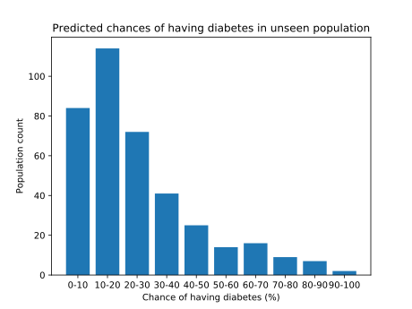

# Python Machine Learning Demo
A very basic demonstration of the use of neural networks in Python.

## Overview
This repository demonstrates very basic use of neural networks for determining the likelihood that an unseen patient has diabetes based on a set of training data included in the `/data` directory (see acknowledgements below).

Additionally, a script is provided that generates visualisations using [Matplotlib](https://matplotlib.org/) from the result of running a neural network trained on half the data over the other half (the *testing* data).

## Usage
The codebase here consists of two files written in Python 3:
+ `predict.py` - trains the neural network on the entire dataset, then asks for parameters of a new unseen patient. Output is the probability that patient has diabetes, in the estimation of the model.
+ `visualise.py` - trains the neural network on half the dataset (the *training* data) and plots the results of running the model over the other half (the *testing* data) as a bar graph. People are bucketed in 10% increments of probability.

To simplify the demo, also included are two bash scripts. Obviously, neither of these will work on Windows (you'll have to call the Python scripts directly):
+ `predict.sh` - Simplifies calling the `predict.py` file. Simply type `bash predit.sh` on a Linux machine to run the demo.
+ `visualise.sh` - Simplifies calling the `visualise.py` file. Simply type `bash visualise.sh` on a Linux machine to run the demo.

## Caveats
Do not use this demo for any serious medical or scientific purposes. Seriously, don't, I put it together in half an hour at 3 in the morning in an airport for a quick demo. Treat the output of any machine learning model with appropriate caution. 

## Acknowledgements
The author would like to thank the following parties for their contribution to this project:
+ The dataset used here is due to [Jason Brownlee](https://github.com/jbrownlee) and his [Machine Learning Mastery](https://machinelearningmastery.com/) repository called [Datasets](https://github.com/jbrownlee/Datasets).
